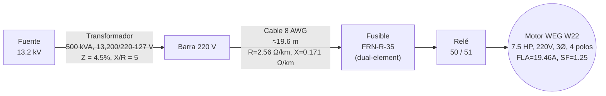

# Estudio de Protección — Motor WEG W22 7.5 HP (Trifásico)
### Fuente 13.2 kV → Transformador 500 kVA → Cable 8 AWG → Fusible + Relé 50/51 → Motor (00718ET3E213T-W22)

## Diagrama Unifilar

---

## Datos del Sistema

| Parámetro | Valor |
|---|---|
| Transformador | 500 kVA |
| Tensión secundaria | **220/127 V** (13,200–220/127 V, dato de placa del transformador) |
| Impedancia del transformador | 4.5% (dentro del rango típico 4–5.5%, NMX-J-205) |
| X/R asumido (transformador) | 5 |
| **Conductor** | **8 AWG** — R = 2.56 Ω/km, X = 0.171 Ω/km (NOM-001-SEDE-2012, Tabla 9, conducto PVC, cobre sin recubrimiento, 75 °C)  |
| **Motor** | **WEG W22, modelo 00718ET3E213T-W22, 7.5 HP (5.5 kW), NEMA, TRIFÁSICO** |
| Tensión / polos | 208-230/460 V, 3Ø, 4 polos, 1765 RPM, 60 Hz, marco 213/5T |
| Corriente nominal de placa | 208 V: 20.5 A · 230 V: 18.6 A · 460 V: 9.29 A *(ver nota de verificación arriba)* |
| **Corriente nominal (interpolada a 220 V)** | **19.46 A** |
| Corriente de arranque de placa (LRC 7.1×, Código H) | 208 V: 145.55 A (calc.) · 230 V: 132.06 A (calc.) |
| **Corriente de arranque (interpolada a 220 V)** | **138.19 A** |
| Eficiencia / FP (dato de placa, 100% carga) | 91.7% / 0.81 |
| Factor de servicio | **1.25** |
| Protección / aislamiento | IP55, Clase F |

**Metodología de interpolación a 220 V** (lineal entre 208 V y 230 V, fracción = (220−208)/(230−208) = 0.5455):
$$FLA_{220} = 20.5 + (18.6-20.5)\times 0.5455 = 19.46\ A$$

Para el LRA, WEG no publica el valor discriminado a 208 V y 230 V para esta variante tri-tensión; se aplicó el múltiplo de código de rotor bloqueado **LRC = 7.1× (Código H)**, confirmado en la ficha técnica de la versión gemela 230/460 V (130 A / 18.4 A = 7.07× ≈ 7.1×), a cada nivel de tensión antes de interpolar:
$$LRA_{208}=20.5\times7.1=145.55\ A,\quad LRA_{230}=18.6\times7.1=132.06\ A$$
$$LRA_{220} = 145.55 + (132.06-145.55)\times 0.5455 = 138.19\ A$$

Verificación de consistencia: $138.19/19.46 = 7.10\times$

---

## Ampacidad del Conductor

NEC/NOM **430.22** exige que la ampacidad del conductor del circuito derivado a un solo motor sea **≥ 125% del FLA**:

$$I_{ampacidad,min} = FLA \times 1.25 = 19.46\ A \times 1.25 = \mathbf{24.33\ A}$$

Ampacidad de referencia — NOM-001-SEDE-2012, Tabla 310-15(b)(16), THHN/THWN-2 a 75 °C, 3 conductores portadores de corriente en conducto, 30 °C ambiente. El conductor 8 AWG tiene ampacidad de **50 A**.

---

## Caída de Tensión (NOM-001-SEDE-2012)

Para el circuito derivado a un motor, el límite es **3%**; considerando además el alimentador, el límite total del sistema es **5%** (NOM-001-SEDE-2012, notas de la Tabla 9). **Este límite del 3%/5% está definido para condición nominal de operación de plena carga (régimen permanente), no para la corriente de arranque a rotor bloqueado** 
**Fórmula (circuito trifásico, NOM-001-SEDE-2012):**

$$\%V = \frac{I \cdot L \cdot Z_{ef} \cdot \sqrt{3}}{V_{ff}} \times 100$$

donde $Z_{ef} = R\cos\varphi + X\sin\varphi$, con FP del motor = 0.81 (dato de placa):

$$\sin\varphi = \sqrt{1-0.81^2} = 0.5864 $$

$$Z_{ef} = (2.56\ \Omega/km\times0.81) + (0.171\ \Omega/km\times0.5864) = 2.0736\ \Omega/km + 0.1003\ \Omega/km = 2.1739\ \Omega/km$$

**Cálculo a corriente nominal (FLA = 19.46 A):**

$$\%V = \frac{19.46\ A \times 0.0196\ km \times 2.1739\ \Omega/km \times \sqrt3}{220\ V} \times 100 = \mathbf{0.65\%}$$

**Caída durante el arranque (LRA = 138.19 A):**

$$\%V_{arranque} = \frac{138.19\ A \times 0.0196\ km \times 2.1739\ \Omega/km \times \sqrt3}{220\ V} \times 100 = \mathbf{4.64\%}$$

---

## Cálculo de Impedancias

### Impedancia del Transformador (referida a 220 V)

$$Z_{base} = \frac{V_{base}^2}{S_{base}} = \frac{(220\ V)^2}{500{,}000\ VA} = 0.09680\ \Omega$$

$$|Z_{trafo}| = 0.045 \times 0.09680\ \Omega = 0.004356\ \Omega$$

Con X/R = 5 (adimensional):

$$X_s = \frac{|Z_{trafo}|}{\sqrt{1+\frac{1}{(X/R)^2}}} = \frac{0.004356\ \Omega}{\sqrt{1.04}} = 0.004271\ \Omega$$

$$R_s = \frac{X_s}{X/R} = \frac{0.004271\ \Omega}{5} = 0.000854\ \Omega$$

**Z_trafo = 0.000854 + j0.004271 Ω**

### Impedancia del Cable (8 AWG, ≈19.6 m)

$$R_{cable} = 2.56\ \Omega/km \times 0.0196\ km = 0.05018\ \Omega$$
$$X_{cable} = 0.171\ \Omega/km \times 0.0196\ km = 0.00335\ \Omega$$

**Z_cable = 0.05018 + j0.00335 Ω**

### Impedancia Total hasta el Motor

$$R_{1,T} = R_s + R_{cable} = 0.000854\ \Omega + 0.05018\ \Omega = 0.05103\ \Omega$$
$$X_{1,T} = X_s + X_{cable} = 0.004271\ \Omega + 0.00335\ \Omega = 0.00762\ \Omega$$

$$|Z_{1,T}| = \sqrt{(0.05103\ \Omega)^2 + (0.00762\ \Omega)^2} = 0.05160\ \Omega$$

**Asunción de puesta a tierra:** transformador sólidamente aterrizado → **Z₀ ≈ Z₁** (aproximación de cálculo manual; el Z₀ real depende de la construcción del núcleo del transformador y puede diferir de Z₁).

---

## Corriente de Cortocircuito en Terminales del Motor

$$V_{LN} = \frac{220\ V}{\sqrt{3}} = 127.017\ V$$

### Falla Trifásica

$$I_{cc,3\phi} = \frac{V_{LN}}{|Z_{1,T}|} = \frac{127.017\ V}{0.05160\ \Omega} = \mathbf{2461.5697\ A}$$

### Falla Monofásica a Tierra (SLG)

Como Z₁ = Z₂ = Z₀ (puesta a tierra sólida, aproximación):

$$I_{cc,SLG} = \frac{3 \cdot V_{LN}}{2|Z_1|+|Z_0|} = \frac{V_{LN}}{|Z_1|} = \frac{127.017\ V}{0.05160\ \Omega} = I_{cc,3\phi} = \mathbf{2461.5697\ A}$$

---

## Corriente Nominal del Motor (FLA) y Ajustes del Relé 50/51

$$FLA = \mathbf{19.46\ A} $$
$$LRA = \mathbf{138.19\ A} \quad \$$

$$\frac{LRA}{FLA} = \frac{138.19\ A}{19.46\ A} = 7.10\times\ $$

Con **FS = 1.25** de placa (≥1.15), NEC 430.32(A)(1) exige usar **125%**:

| Ajuste | Fórmula | Resultado (primario) |
|---|---|---|
| Pickup 51 (sobrecarga) | FLA × 1.25 | **24.33 A** |
| LRA (arranque, dato de placa) | — | **138.19 A** |
| Pickup 50 (instantáneo) | LRA × 1.7 | **234.92 A** |

$$Pickup_{51} = 19.46\ A \times 1.25 = 24.33\ A$$
$$Pickup_{50} = 138.19\ A \times 1.7 = 234.92\ A$$

*(El factor 1.7 en el pickup instantáneo es un margen de coordinación de protecciones de práctica común — 1.6 a 2.0× LRA — para evitar disparo por la asimetría del arranque; no proviene de una tabla NEC/NOM específica, sino de guías de aplicación de relevadores tipo IEEE C37.96.)*

---

## Criterio de Selección de Curva y Calibración del Dial de Tiempo (51)

Antes de fijar el dial de tiempo (Time Dial, TD) del elemento 51, el protocolo normativo (IEEE C37.112 / IEC 60255, coordinado con IEEE 242) exige justificar primero **qué forma de curva usar** y **dónde debe quedar posicionada** en el plano TCC. Resumen del criterio aplicado:

**1. Ventana de operación (pasillo TCC).** La curva del 51 debe quedar:
- **Por encima** del perfil de arranque del motor (con margen para tolerar la asimetría/DC offset del inrush en los primeros ciclos), y
- **Por debajo** de la curva de daño térmico del motor (Safe Stall Time, en frío y en caliente, dato de fabricante).

**2. Forma de la curva: Extremadamente Inversa (EI).** El calentamiento del estator ante sobrecarga prolongada sigue el principio de energía pasante constante, $I^2t = K$. De las familias normalizadas (IEEE C37.112: Moderadamente Inversa, Muy Inversa, Extremadamente Inversa), la curva **EI** es la que replica esa pendiente $I^2t$, por lo que "abraza" la curva de daño del motor sin cruzarla: da disparo rápido ante fallas/sobrecorrientes altas y tiempo amplio ante sobrecargas ligeras. Usar una curva Normalmente Inversa (SI) tendría pendiente distinta a la del daño térmico, generando zonas de sub- o sobre-protección.

**3. Coordinación aguas arriba.** Tanto el fusible de respaldo (FRN-R-35, curva dual-element ≈ $I^2t$) como la curva de daño del transformador (ANSI/IEEE C57.109, también $I^2t$ — ver sección correspondiente) son perfiles térmicos de la misma familia. Usar EI en el 51 mantiene las tres curvas (motor, relé, fusible/transformador) con pendientes paralelas en el TCC, preservando selectividad en toda la banda de corriente.

**4. Calibración del Time Dial (TD).** Con la forma EI fijada, el TD se ajusta iterando hasta que, a la corriente de rotor bloqueado (LRA), el relé dispare **antes** del Safe Stall Time (caliente) del motor, dejando un margen empírico de **1–2 s** por encima del tiempo real de arranque (para no disparar en un arranque normal). Ecuación general IEEE C37.112:
 
$$t(M) = TD\times\left[\frac{A}{M^{p}-1}+B\right], \qquad M=\frac{I}{Pickup_{51}}$$
 
**Constantes A, B, p por familia de curva (IEEE C37.112):**
 
| Curva (IEEE C37.112) | A | B | p |
|---|---:|---:|---:|
| Moderadamente Inversa (MI) | 0.0515 | 0.1140 | 0.02 |
| Muy Inversa (VI) | 19.61 | 0.4910 | 2.00 |
| **Extremadamente Inversa (EI)** | **28.2** | **0.1217** | **2.00** |
 
*(Referencia cruzada — familias equivalentes en IEC 60255, ecuación $t=TMS\times\dfrac{k}{M^{\alpha}-1}$, sin término B):*
 
| Curva (IEC 60255) | k | α |
|---|---:|---:|
| Normalmente Inversa (SI / IEC-SI) | 0.14 | 0.02 |
| Muy Inversa (VI / IEC-VI) | 13.5 | 1.00 |
| Extremadamente Inversa (EI / IEC-EI) | 80.0 | 2.00 |
Con $Pickup_{51}=24.33\ A$ y evaluando en $I=LRA=138.19\ A$:

$$M_{LRA}=\frac{138.19}{24.33}=5.68$$

$$t(TD, M_{LRA}) = TD\times\left[\frac{28.2}{5.68^{2}-1}+0.1217\right] = TD\times 1.024\ s$$

| TD | t a LRA (5.68×pickup) [s] |
|---:|---:|
| 0.5 | 0.51 |
| 1 | 1.02 |
| 2 | 2.05 |
| 3 | 3.07 |
| 4 | 4.10 |
| 5 | 5.12 |
| 6 | 6.14 |
| 7 | 7.17 |
| 8 | 8.19 |
| 10 | 10.24 |

**Criterio de selección final:**
$$t_{arranque,real} + (1\ a\ 2\ s) \;<\; t(TD, LRA) \;<\; SST_{caliente}$$

---

## Selección de Fusible de Respaldo

$$I_{min,fusible} = FLA \times 1.75 = 19.46\ A \times 1.75 = 34.06\ A$$

**Fusible seleccionado: Fusetron FRN-R-35** 

$$\frac{35\ A}{19.46\ A}=179.9\%\ FLA$$

Se aplica la **Excepción 1** de NEC 430.52(C)(1): el valor calculado (34.06 A) no coincide con un tamaño estándar de NEC 240.6(A) (...30, 35, 40...), por lo que se permite subir al siguiente tamaño estándar — 35 A. *(Verificado: NEC Tabla 430.52, fusible dual-element = 175% FLA como techo de cálculo; la Excepción 1 permite explícitamente exceder ese porcentaje al redondear al tamaño estándar superior — 179.9% .)*

**Calibración de la curva del fusible** (K es propiedad de la familia Fusetron, normalizada en múltiplos de la corriente nominal del fusible; el mismo K aplica a cualquier tamaño de la familia — modelo I²t simplificado; la curva TCC real del fabricante no es perfectamente I²t en todo el rango, pero es una aproximación razonable para verificación de coordinación):

$$X_{ref}=5.0\times I_{fusible}=5.0\times 35\ A = 175\ A,\quad t_{ref}=10\ s$$

$$K=t_{ref}\times\left(\frac{X_{ref}}{I_{fusible}}\right)^2 = 10\ s\times(5.0)^2\ \text{(adim.)} = 250\ s$$

$$t_{fusible}(I) = K \times \left(\frac{I_{fusible}}{I}\right)^2 = 250\ s \times \left(\frac{35\ A}{I}\right)^2$$

**Verificación de arranque:**
$$t_{fusible}(138.19\ A) = 250\ s\times\left(\frac{35\ A}{138.19\ A}\right)^2 = 16.04\ s$$

Margen amplio frente a un arranque típico de unos pocos segundos.

---

## Selección y Verificación del CT

$$I_{CT,min\ por\ carga} = FLA \times 1.25 = 19.46\ A\times1.25=\mathbf{24.33\ A}$$

Este valor por sí solo sugeriría un CT pequeño (p. ej. 25/5 A o 30/5 A). **Sin embargo**, el CT debe además evitar saturarse durante la falla real del sistema (2461.7 A). Para una clase de precisión 5P40 (factor límite de precisión = 40×), el CT debe cumplir:

$$I_{CT,primario} \geq \frac{I_{cc,3\phi}}{40} = \frac{2461.5697\ A}{40} = 61.5\ A$$

El siguiente tamaño estándar por encima de 61.5 A es **75 A** — por eso la relación seleccionada es **75/5 A** (RTC=15). La clase final es **5P20/15 VA (MBS SASK 31.6)**, cuyo ALF real (≈ 49 con el burden de este estudio) supera el 40 nominal del prediseño — ver justificación completa en la sección de burden.

**Nota de diseño:** esto es un compromiso típico entre precisión de medición en carga normal y precisión de protección durante fallas. Con el motor trifásico real (FLA=19.46 A), la corriente en el secundario a plena carga es de solo 19.46/15 = **1.30 A** (26% del secundario nominal de 5 A) — más baja resolución para medición de carga normal, pero necesaria para que el CT no sature durante una falla real. Si la prioridad fuera solo medición de carga, un CT 25/5 o 30/5 sería más adecuado, pero no protegería correctamente la exactitud del relevador durante la falla.

Con ALF real ≈ 49, el límite lineal del CT es 49 × 75 A ≈ 3650 A > 2461.7 A, por lo que se mantiene dentro de su clase de precisión (±5%) hasta la corriente de falla real.

**Pickup 51 en secundario:** 24.33 A / 15 (RTC) = **1.622 A secundario**
**Pickup 50 en secundario:** 234.92 A / 15 (RTC) = **15.66 A secundario**

---

### Circuito secundario del CT 

> **Caso :** distancia CT ↔ relé SEL-710 de **20 m**, conductor de cobre **10 AWG (5.26 mm²)**, resistividad a 75 °C $\rho = 0.0214\ \Omega\cdot mm²/m$, ida y vuelta (factor ×2). Este circuito secundario es independiente del cable de potencia de 8 AWG / 19.6 m.

**Tabla de sensibilidad — resistencia del cable ida y vuelta por longitud y calibre:**

| Longitud CT→relé | 14 AWG (2.08 mm²) | 12 AWG (3.31 mm²) | 10 AWG (5.26 mm²) |
|---:|---:|---:|---:|
| 10 m | 0.206 Ω | 0.129 Ω | 0.081 Ω |
| 20 m | 0.412 Ω | 0.259 Ω | 0.163 Ω |
| 30 m | 0.617 Ω | 0.388 Ω | 0.244 Ω |
| 50 m | 1.029 Ω | 0.647 Ω | 0.407 Ω |

*(Verificado con $R = 2L\rho/A$.)*

**Cargas nominales típicas de placa (IEC 61869-2) y su impedancia equivalente a 5 A ($Z = VA/25$):**

| Burden nominal de placa | Impedancia equivalente |
|---:|---:|
| 2.5 VA | 0.10 Ω |
| 5 VA | 0.20 Ω |
| 10 VA | 0.40 Ω |
| 15 VA | 0.60 Ω |
| 30 VA | 1.20 Ω |

**Burden total del caso adoptado (20 m, 10 AWG):**

$$R_{cable} = \frac{2 \times 20\ m \times 0.0214}{5.26} = 0.163\ \Omega$$

$$S_{cable} = (5\ A)^2 \times 0.163\ \Omega = 4.07\ VA$$

Relé SEL-710, modelo 5 A (dato de ficha, manual de instrucciones): burden $<0.1\ VA$ por fase, es decir $Z_{rele} = 0.004\ \Omega$. Reserva por contactos y terminales (previsión explícita): $0.05\ \Omega$, es decir $1.25\ VA$.

$$S_{total} = 4.07\ VA + 0.10\ VA + 1.25\ VA = 5.42\ VA \quad (36.1\%\ de\ 15\ VA)$$

### TC comercial seleccionado

| Concepto | Especificación |
|---|---|
| Fabricante / serie | **MBS AG (Alemania), SASK 31.6** — TC toroidal de BT para protección |
| Relación | 75/5 A — RTC = 15 |
| Clase / burden | 5P20, 15 VA |
| Tensión máx. / ensayo | $U_m = 0.72\ kV$, ensayo de aislamiento 3 kV, 50 Hz, 1 min |
| Corriente térmica continua | $I_{cth} = 1.0\,I_{pr} = 75\ A$ |
| Corriente térmica de corta duración | $I_{th} = 60\,I_{pr} = 4500\ A/1\ s$ |
| Ventana | conductor redondo 23 mm (el alimentador 8 AWG pasa con holgura; en montaje real verificar además diámetro exterior con aislamiento, terminales y canalización) |
| Dimensiones | 95 × 116 × 74 mm |
| Norma | DIN EN 61869-1/2 |
| Aplicación | Protección |
| Fabricante | MBS AG – SASK 31.6 ([ficha oficial](https://mbs-ag.com/en/produkt/sask-31-6/)) |

**Por qué 5P20 y no 5P40:** la serie SASK de BT llega hasta 5P30; no existe 5P40/75 A en BT de este fabricante y no hace falta. Con burden real liviano (5.42 VA frente a 15 VA nominales), el ALF real del 5P20 supera el 40 nominal del prediseño. A modo de contraste: con burden nominal de 10 VA el ALF real quedaría en 33.7, apenas 3% sobre el requerido 32.82 y exigiendo $R_{ct}$ menor o igual a $0.069\ \Omega$, margen inaceptable sin dato de ficha. Eso es lo que justifica subir a 15 VA y no quedarse en 10 VA.
### Qué significa 5P20

Con el TC $75/5\ A$, $5P20$, $15\ VA$, el 5P20 dice, de forma simplificada, que el factor límite de precisión es $ALF = 20$. La corriente secundaria correspondiente al límite de exactitud es:

$$I_{ALF} = 20 \times 5\ A = 100\ A$$

y en el primario:

$$I_{ALF} = 20 \times 75\ A = 1500\ A$$

Es decir, la placa $75/5\ A$, $5P20$ no solo dice "este TC transforma 75 A a 5 A", sino que informa su comportamiento frente a corrientes elevadas de falla. Y eso conecta directamente con este estudio: la falla calculada y verificada es $2461.7\ A$, es decir $2461.7/75 = 32.82$ veces la nominal por encima del 20 nominal. 

Los 15 VA son el **burden nominal del secundario**, no la resistencia óhmica interna del devanado. Lo que sí puede calcularse del burden nominal es su impedancia equivalente a corriente secundaria nominal ($I_s = 5\ A$):

$$S = I^2 Z \quad\Rightarrow\quad Z_{eq} = \frac{15}{5^2} = 0.6\ \Omega$$

Llamarlo así:

$$Z_{eq} = 0.6\ \Omega \quad\text{(impedancia equivalente al burden nominal)}$$

y **no** resistencia interna del TC. La resistencia interna del devanado ($R_{ct}$) es otro dato sale de la ficha del lote y entra al cálculo del ALF real como sigue.

### ALF real 

Múltiplo requerido por la falla del sistema:

$$n_{req} = \frac{2461.7\ A}{75\ A} = 32.82$$

$$ALF_{real} = ALF_{nom}\times\frac{S_n + S_{int}}{S + S_{int}},\quad S_{int} = (5\ A)^2 R_{ct}$$

**De dónde sale $R_{ct}$:** la ficha web del SASK 31.6 no publica la resistencia del devanado por variante (dato que sí aparece en el protocolo de ensayos de rutina del lote, IEC 61869). En su lugar se usan dos argumentos independientes. Primero, estimación física de orden de magnitud: el secundario de un 75/5 A toroidal tiene $N_2 = 15$ espiras; con espira media de ≈ 0.3 m en cobre de ≈ 2 mm²:

$$R_{ct} \approx \frac{15 \times 0.3\ m \times 0.0214}{2.0} \approx 0.05\ \Omega \quad (S_{int} = 1.25\ VA)$$

$$ALF_{real} = 20\times\frac{15 + 1.25}{5.42 + 1.25} = 48.7 \geq 32.82 $$

Chequeo cruzado de tensión secundaria (criterio tipo clase C, informativo): con $R_{ct} \approx 0.05\ \Omega$, $V_s = 164.1\ A \times 0.267\ \Omega \approx 44\ V$. Relación X/R en bornes del motor ≈ 0.15, por lo que la componente de DC del cortocircuito es despreciable y basta el criterio de régimen permanente (sin sobredimensionar por transitorio).

## Curva de Daño del Transformador (ANSI/IEEE C57.109)

### Categoría del Transformador

| Categoría | Monofásico | Trifásico |
|---|---|---|
| I | 5–500 kVA | 15–500 kVA |
| II | 501–1667 kVA | 501–5000 kVA |
| III | 1668–10,000 kVA | 5001–30,000 kVA |
| IV | > 10,000 kVA | > 30,000 kVA |

Este transformador (**500 kVA, trifásico**) cae justo en el límite superior de **Categoría I**. *(Verificado contra IEEE C57.12.00/C57.109: los rangos de la tabla coinciden.)*

### Corriente Base del Transformador

$$I_{FLA,trafo} = \frac{S_{trafo}}{\sqrt{3}\cdot V_{LL}} = \frac{500{,}000\ VA}{\sqrt{3}\times 220\ V} = \mathbf{1312.16\ A}$$

### Corriente Máxima de Falla Posible (bornes BT del transformador, sin cable)

$$I_{max} = \frac{I_{FLA,trafo}}{Z_{pu}} = \frac{1312.16\ A}{0.045\ \text{(adim.)}} = \mathbf{29{,}159\ A} = 22.22\times I_{FLA,trafo}$$

Como esta corriente máxima (22.2×) es menor que 40×, la curva estándar de Categoría I cubre el rango completo de fallas posibles en este transformador.

### Ecuación de la Curva (Categoría I)

$$I_{pu}^2 \cdot t = K = (25\ \text{adim.})^2 \times 2\ s = 1250\ s \quad\Rightarrow\quad t(I_{pu}) = \frac{1250\ s}{I_{pu}^2}$$

Válida entre **2× y 40×** de I_FLA,trafo. *(Verificado contra literatura IEEE/SEL sobre C57.109: K=1250 y el rango de validez 2×–40× para Categoría I son correctos.)*

### Tabla de la Curva

| Múltiplo de I_FLA,trafo | Corriente (A) | Tiempo de daño (s) |
|---:|---:|---:|
| 2× | 2,624.3 | 312.50 |
| 3× | 3,936.5 | 138.89 |
| 4× | 5,248.6 | 78.12 |
| 5× | 6,560.8 | 50.00 |
| 6× | 7,873.0 | 34.72 |
| 8× | 10,497.3 | 19.53 |
| 10× | 13,121.6 | 12.50 |
| 15× | 19,682.4 | 5.56 |
| 20× | 26,243.2 | 3.12 |
| 22.22× (I_max, Z=4.5%) | 29,159.1 | 2.53 |
| 25× | 32,804.0 | 2.00 |
| 30× | 39,364.8 | 1.39 |
| 40× | 52,486.4 | 0.78 |

---

## Resumen de Ajustes Finales

| Elemento | Ajuste |
|---|---|
| Sistema | 220Y/127 V |
| Motor | WEG W22 7.5HP, **00718ET3E213T-W22 (trifásico)**, FLA=19.46A (a 220V)  |
| **Conductor** | **8 AWG**, R=2.56 Ω/km, X=0.171 Ω/km, ≈19.6 m — ampacidad 50A @75°C (205.5% del requerido) |
| **Caída de tensión a FLA** | **0.65%** — cumple 3% (derivado) |
| **Caída de tensión en arranque** | **4.64%** |
| **CT** | **MBS SASK 31.6, 75/5 A** (RTC=15), **5P20, 15 VA**, Ith 60×In — ALF real ≈ 49 (límite ≈ 3650 A) > falla 2461.7 A |
| Fusible de respaldo | **FRN-R-35** (dual-element, Excepción 1 del 430.52) |
| Pickup 51 | 24.33 A primario → **1.622 A secundario** (RTC=15) |
| Curva 51 | Extremadamente Inversa (EI), IEEE C37.112 — coordina con perfil $I^2t$ del fusible y de C57.109 |
| Dial de tiempo (TD) 51 | **Provisional TD ≈ 3** (t≈3.07 s a LRA) — pendiente de validar contra Safe Stall Time (frío/caliente) de ficha WEG, no disponible en este estudio |
| Pickup 50 | 234.92 A primario → 15.66 A secundario |
| **I_cc,3φ en el motor** | **2461.7 A**  |
| **I_cc,SLG en el motor** | **2461.7 A**  |
| Categoría transformador (ANSI/IEEE C57.109) | Categoría I (trifásico, límite 500 kVA) |
| I_FLA,trafo (base 220V) | 1312.16 A |
| I_cc,3φ en pu de I_FLA,trafo | **1.876×** — fuera del rango válido de la curva (2×–40×); el transformador no está en riesgo de daño por falla en este punto |
| t_daño extrapolado (no normativo) | 355.1 s |